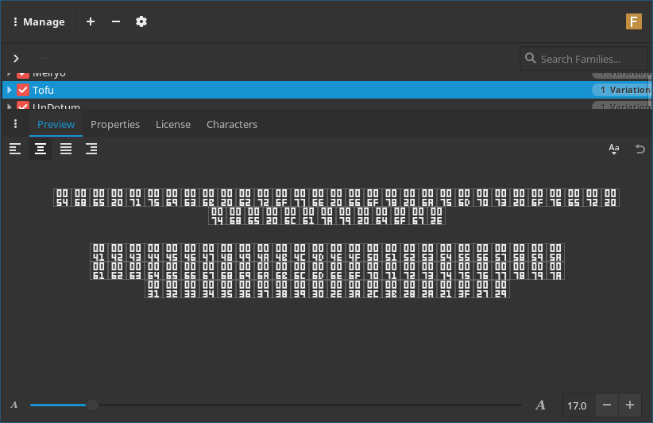

# Tofu

  
For the curious, this is [font-manager](https://fontmanager.github.io/)

### What is this?
This is an attempt by me to make a font (collection) that is just a box with the unicode code point inside. These are usually not in a font but rather programmatically generated by programs as they encounter characters that have no associated glyph.

### Why?
Because I wanted zero width characters in my code to be not zero width. I was trying out vss code (pretty nice imo) and found I should be able to use some CSS magic to make it so that certain characters are displayed by this font. ([see also](https://graphicdesign.stackexchange.com/questions/95687/making-a-tofu-font))

### Things that need to get fixed
 * It's not very readable when small. Make better tofu template
 * The size of the generated font collection can probably be made smaller (for example by excluding unassigned characters)
 * The progress bar isn't smooth since the fontforge lib provides no way to measure its progress when loading the generated .sfd files

### This is stupid
Yeah probably, but for its very specific use case it's not terribly bad.

### Generating a font
Caching should take care of the intensive IO issue, if not then use a ramdisk.

I used python3 for this, it may work in python2. If it does not please feel free to make a pull request to fix it but I am not actively supporting python2.

The syntax for the program is as follows. `gen_tofu.py 0000-FFFD [10000-1FFFF] [-s X]`  
`0000` is the start of the first range  
`FFFD` is the end of the first range  
`10000` is the start of the second range (optional, you can use as many ranges as you want)  
`1FFFF` is the end of the second range (optional)  
`X` is the number of characters that each font will contain (optional)

### License
MIT, not sure if the font needs a special license. ▯
